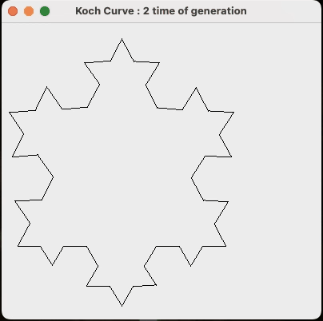
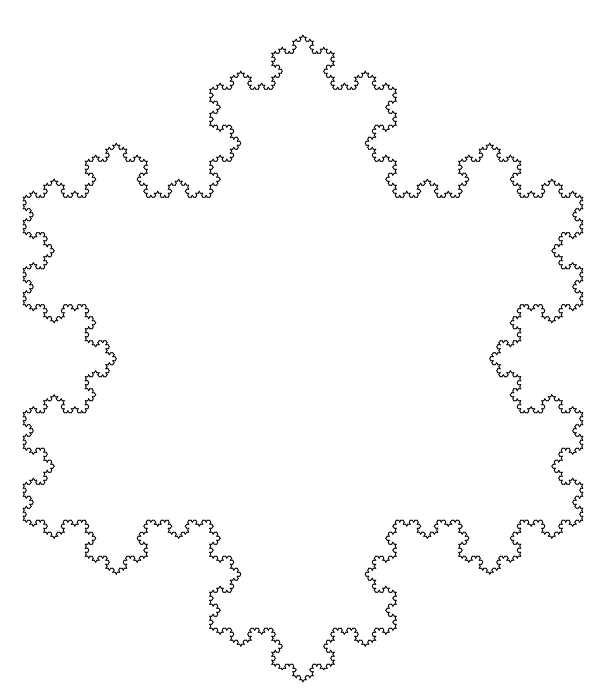

### How to start :
```
cd Snow/
java kochCurve.java
```


## UPDATE 
To add functionality for controlling the generation time of the Koch curve in a Java program, two buttons can be implemented. When the "next level" button is clicked, the program should refresh the frame and draw a new generation of the Koch curve, with the previous level being the reverse of the next level. Additionally, the program can be designed to automatically rescale the snowflake based on the actual window size. This would involve monitoring changes in the window size and adjusting the size and position of the snowflake accordingly. To accomplish these tasks, appropriate event listeners can be used along with appropriate scaling and drawing functions.
### Introduction of the code : 
```

This is a Java program that uses recursion to draw a Koch snowflake. The program creates a custom JComponent called MyCanvas which extends JComponent and draws the snowflake using the DrawKoch method. The main class, kochCurve, creates a JFrame and adds an instance of MyCanvas to it.

The MyCanvas class has a component listener that updates the preferred size of the canvas when the frame is resized. It also has a paint method that draws the snowflake using the DrawKoch method. The DrawKoch method is the most important method in the class, and it uses recursion to draw the snowflake by dividing the line segments into smaller segments and then recursively calling itself on those smaller segments.

The kochCurve class is responsible for creating the JFrame and adding the MyCanvas instance to it. It also sets the size of the frame and makes it visible.
```
***Display:<br>***


***Video Demo:<BR>***
[](https://drive.google.com/file/d/1_TGJzN-0bMnnF9yL4PogpA678wTv9Y4I/view?usp=sharing)


**15/Mar.23**<br>
 - now the Koch curve speed is hugely improved
   * average time of generated koch curve under 12 is less than 1 second
   

**14/Mar/23**<br>
- improve the Koch curves, also change the math equation. 
  * before it need to calculate the angle in each time, and divide it to 3 pices.
  * Now, update the math equation by calculated rest 3 point of the curve, each time generating the sub-curve, there is only need to figure out points location and line them up. 
  * speed improvement is huge than old approach. 


**12/Mar/23<br>
 - finish Koch curves 
   * solution using recursive algorithm
   * if the time of curves made is less than 5 it runs smoothly and quickly, but if large than 5 it runs slower. the more the slower.
<br>
**8/Mar/23**<br>
update(5.34pm): <br> 
     - done it(finally)
     - correct calculation of leap year 
     - handle error input format list below 
     - create testing data
  


